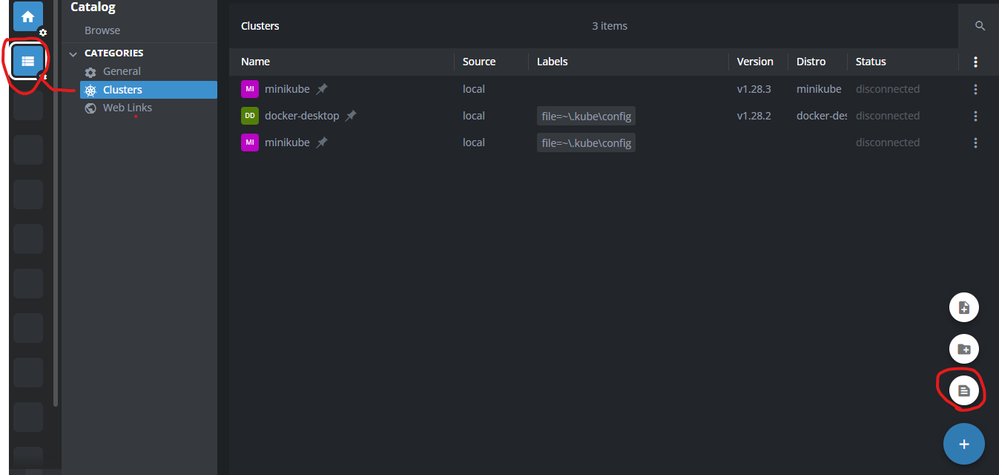
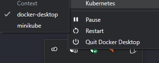

How to start minikube and kubernetes with docker and connect to Lens

First of all, you need to install minikube.
Minikube allow you to run a local Kubernetes cluster on your machine.
its a light weight version of kubernetes. Used for development and testing purposes.
You must have kubernetes installed to check it 
```
kubectl version
```
If you'v a docker desktop there is a option to enable kubernetes in the settings.
When enable kubernetes, a cluster has been created and you can connect to it with Lens.
To connect it to lens you need to view the config file of kubernetes by running the following command:
```
kubectl config view --minify --raw
```
Then you copy the entire config file and paste it in the lens config file.


After that, you can start minikube with the following command:
by default minikube will use virtualbox as driver.
we want to use docker as are driver for creating a cluster.
Minikube creating a cluster with master(my machine) and node that can be Docker/Virtualbox etc...
```
minikube start --driver=docker
```
To check if the cluster is running, run the following command:
```
kubectl get nodes 
```
To connect to the minikube with Lens you need to change the docker setting
by click right click on docker icon and select minikube
